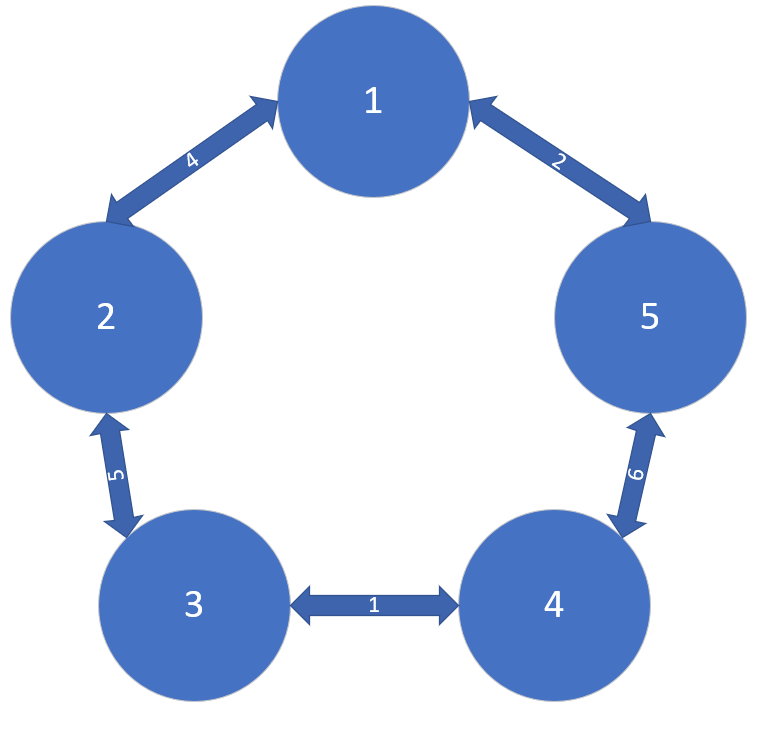
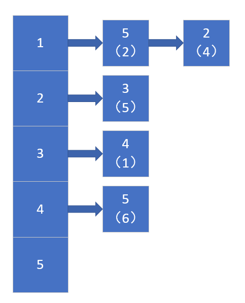

# BFS-Basic-ideas
这是广搜算法基本思路，有兴趣的可以看看一下

# BFS 广搜算法

---

讲一下图的遍历，广搜。

广搜是图的遍历的一种，它能够在图中的两的点之间找到一条最短的一条路径。但是如果仅使用广搜，搜索的规模会与点的数量以及边的数量有关。当规模很大的时候，广搜不是一种很好的解决方案。

---

### 举个例子，这是图的形式


### 然后便是其邻接矩阵的形式：


### 再者是其邻接表的形式：



>如若没有了解该算法的大体思想，可以参考我的另一篇文章

>[------>这是链接<------](https://www.cnblogs.com/Yunrui-blogs/p/11075213.html)

### 以下便是代码，改代码使用的是链式结构，即邻接表实现，输入格式在main.cpp中注释部分

---

### main.cpp

```C++
#include"GraphBFS.h"

int main()
{
	GraphBFS g1;
	g1.Init();
	g1.Display();
	return 0;
}
/*
5
5
1 5 2
1 2 4
2 3 5
3 4 1
4 5 6
*/

```

### GraphBFS.h

```C++
#pragma once
#ifndef _GRAPHBFS_H_
#define _GRAPHBFS_H_
#include<iostream>
#include<cstdlib>
#include<queue>
#include<vector>
using namespace std;
const int MAX = 0xffffff;

struct nPoint
{

	int arrive;
	int d;
	nPoint* next = nullptr;
	
};
class GraphBFS//使用邻接表访问
{
private:
	int nodeNumber;
	int begin, end;
	vector<nPoint>Graph;//连续性，相当于头指针
	vector<bool>visited;//判断是否经历过
	vector<int>distance;//距离
	vector<int>parent;//父母
	queue<int>q1;//队列

	void BFS(int s);//进行广搜
	void PrintPath(int b, int e);//打印路线
	void LinkNode(int locate,nPoint *p);//链接nPoint结点

public:
	GraphBFS();//构造函数
	void Init();//初始化
	void Display();
	~GraphBFS();

 };
#endif // !_GRAPHBFS_H_

```

### GraphBFS.cpp

```c++

#include "GraphBFS.h"

GraphBFS::GraphBFS()
{
	nodeNumber = 0;
	begin = end = 0;
	Graph.clear();
	visited.clear();
	distance.clear();
	while (!q1.empty())
		q1.pop();
}

void GraphBFS::Init()
{
	cout << "请输入点的个数" << endl;
	cin >> nodeNumber;
	Graph.resize(nodeNumber + 1);//链表申请
	visited.resize(nodeNumber + 1, false);
	distance.resize(nodeNumber + 1, MAX);
	parent.resize(nodeNumber + 1, -1);
	cout << "请输入有几个关系" << endl;
	int a,b,c;
	cin >> a;
	cout << "请输入各边的关系以及距离" << endl;
	while (a--)
	{
		nPoint* p = new nPoint;
		cin >> b >> c >> p->d;
		p->arrive = c;
		LinkNode(b, p);//利用头插法插入链表中，b是定位到那个链表
	}
	cout << "请输入开始点和结束点" << endl;
	cin >> begin >> end;
}

void GraphBFS::BFS(int s)
{
	visited[s] = true;
	distance[s] = 0;
	q1.push(s);
	while (!q1.empty())
	{
		int u = q1.front();
		nPoint* op1 = Graph[u].next;
		while (op1)
		{
			if (!visited[op1->arrive])
			{
				q1.push(op1->arrive);
				parent[op1->arrive] = u;
				distance[op1->arrive] = distance[u] + op1->d;
				visited[op1->arrive] = true;
			}
			op1 = op1->next;
		}
		q1.pop();
	}
}


void GraphBFS::LinkNode(int locate, nPoint *p)
{
	nPoint* op1 = nullptr;
	op1 = Graph[locate].next;
	Graph[locate].next = p;
	p->next = op1;
	op1 = nullptr;
}

void GraphBFS::Display()
{
	BFS(begin);
	cout << "路径是: ";
	PrintPath(begin, end);
	cout << endl << "距离是: " << distance[end] << endl;
}

void GraphBFS::PrintPath(int b, int e)
{
	if (b == e)
		cout << b << " ";
	else if (parent[e] == -1)
		return;
	else {
		PrintPath(b, parent[e]);
		cout << e << " ";
	}
}

GraphBFS::~GraphBFS()
{
	Graph.clear();
	visited.clear();
	while (!q1.empty())
		q1.pop();
	begin = end = 0;
	nodeNumber = 0;
}

```

---


